  
  

<h1 align="center">Hi 👋, I'm Madhav Agarwal</h1>

  

  

---

## 🗺️ Featured Client Projects

  
<b>🏥 FBS Healthcare</b> — Order & Employee Operations System

   

### ⚡ System Overview

An internal, core operations platform designed to clean up daily workflows, manage complex task dispatching, track live orders, and coordinate staff scheduling efficiently.

### 🛠️ Architecture & Tech Stack

| Layer              | Technology             | Primary Responsibility                                                   |
| :----------------- | :--------------------- | :----------------------------------------------------------------------- |
| **Frontend**       | Next.js & TypeScript   | Intuitive internal administrative portal usable by non-technical staff   |
| **Backend Engine** | Next.js Server Actions | Encapsulated business rules, tracking events, and secure execution lines |
| **Database / ORM** | Prisma & MySQL         | Fully schema-structured transactional storage and relation safety        |

### 🛠️ Engineering Challenges & Breakthroughs

- **From Google Sheets to Schema:** Mapped loosely-coupled spreadsheet layouts directly into solid relational structures, converting messy data into indexed tables without breaking history.
- **Granular Role-Based Security:** Engineered fine-grained access control tables isolating system features seamlessly between system Admins, Operations Managers, and Field Employees.
- **Operational Flow Logic:** Built heavy data validation steps ensuring sequence dependencies (order placements, tracking histories, staff updates) run linearly without system collision.

<!-- 🔗 **Repository:** [View on GitHub](https://github.com/MadhavAgarwal1411/fbs-healthcare) -->

  
<b>💼 Mascot E-Services</b> — Recruiter Consultant Management Software (CMS)

   

### ⚡ System Overview

A highly customized workflow hub optimized for recruiting operations. It handles profile indexing, client assignment tracking, and candidate placement services from one centralized workspace.

### 🛠️ Architecture & Tech Stack

| Component           | Stack                | Primary Focus                                                                   |
| :------------------ | :------------------- | :------------------------------------------------------------------------------ |
| **Web Application** | Next.js / TypeScript | High-density control desk for consultant records and pipeline audits            |
| **API Gateway**     | Node.js / REST       | Asynchronous data layer maintaining state parity between web and mobile devices |

### 🛠️ Engineering Challenges & Breakthroughs

- **Workflow Consolidation:** Extracted operational knowledge from legacy manual spreadsheets, building a custom relational system to organize candidate profiles and company assignments cleanly.
- **Low-Friction UI Adoption:** Focused on crafting clean user interface flows to help manual users drop legacy spreadsheet tracking easily without experiencing layout shock or confusion.

<!-- 🔗 **Repository:** [View on GitHub](https://github.com/MadhavAgarwal1411/mascot-e-services) -->

---

## 🏆 Notable Projects

- 🚗 [Car Renting App](https://github.com/MadhavAgarwal1411/car_renting_app): A comprehensive platform for seamless car rentals.
- 🥦 [Green Basket App](https://github.com/MukundSB19/Green-Basket-App): Making grocery shopping greener and smarter.

---

## 🤝 How I Help Businesses

I partner with teams and small businesses to automate manual workflows, sunset legacy spreadsheets, and build secure, fast software platforms.

* **🔍 Process Auditing:** I sit down with your teams to map out unorganized Google Sheets or manual steps into crisp, relational logic.
* **🏗️ Custom Database Design:** I model strict SQL schemas with Prisma ORM to ensure your client data, transactions, and inventories stay relational and fast.
* **🔒 Role-Based Security:** I build explicit access privileges (Admins, Managers, Employees) to keep corporate dashboards secure and simple for non-technical users.

## 🌱 Currently Learning

- DevOps
- Backend scalability & database design
- Mobile development with React Native & Expo

---

## ♟️ Fun Fact

I'm a chess enthusiast—let's play a game sometime!

---

## 📬 Let's Build Something Together

Got a workflow trapped in a spreadsheet or an internal system that needs scaling? Let’s grab a coffee and talk about your system architecture.

---

## 📖 Profile Guestbook

Are you visiting my profile? I’d love to know where you are visiting from or what you're building! Click the button below to sign my public profile guestbook and leave a note.

---

### 🛠️ Tech Stack

✨ **Frontend & Mobile**  

🚀 **Backend & Database**  

🌐 **Infrastructure**  

---

<h3 align="center">💻 Languages and Tools</h3>

   
   
   
   
  
   
   
   
  
   
   
   
  
  
  
  
  
  

---

<h3 align="center">📊 My GitHub Stats</h3>

  
  

  
  

---

<h3 align="center">🏆 GitHub Trophies</h3>

  

